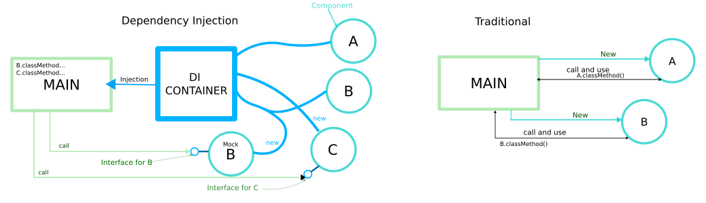

# [ACADEMIA] Inyeccion de dependencias con Spring Framework
Proyectos de ejemplo para mostrar una aplicación tradicional vs una con Spring

## Estructura
Las dos están divididas en capas: Service y Repository. En el caso de la aplicación tradicional, el "control" de la ejecución lo tiene el método main.
En la aplicación hecha con Spring, se [invierte el control](https://es.wikipedia.org/wiki/Inversi%C3%B3n_de_control) y sólamente se declaran **componentes** manejados por un [container](https://docs.spring.io/spring/docs/current/spring-framework-reference/core.html#beans-introduction) que provee el framework

NOTA: el patrón de arquitectura indica que las dependencias se declaren usando interfaces. La última versión de Spring (5.0) soporta el uso de clases directamente para simplificar nuestro código
